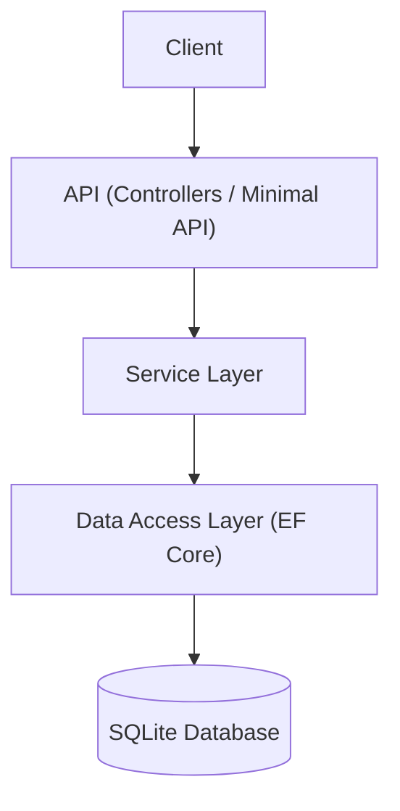

# Flight Booking System (.NET 9 REST API)

## Proje Açıklaması
Bu proje, **.NET 9** kullanılarak geliştirilmiş, minimal API ve Layered Architecture (Katmanlı Mimari) prensiplerini bir araya getiren bir **Uçuş Rezervasyon Sistemi**dir. Proje, kullanıcıların uçuşları listelemesine, rezervasyon yapmasına ve ödeme işlemlerini gerçekleştirmesine olanak tanır.

Proje, **Entity Framework Core** kullanılarak veritabanı işlemlerini yönetir ve **SQLite** veritabanı ile çalışır. DTO (Data Transfer Objects) kullanımı, Dependency Injection, Global Exception Handling ve Swagger entegrasyonu gibi modern web geliştirme standartlarına uygundur.

## Kullanılan Teknolojiler
- **.NET 9**
- **Entity Framework Core** (ORM)
- **SQLite** (Veritabanı)
- **Minimal API** ve **Controllers** (Hibrit kullanım)
- **Swagger / OpenAPI**
- **Dependency Injection**

## Mimari Yapı
Proje **Katmanlı Mimari (Layered Architecture)** prensiplerine göre yapılandırılmıştır:

1.  **Presentation Layer (Sunum Katmanı)**: `Controllers` ve `Program.cs` (Minimal API). API endpoint'lerini dış dünyaya sunar.
2.  **Service Layer (Servis Katmanı)**: `Services` klasörü. İş mantığını (Business Logic) içerir.
3.  **Data Access Layer (Veri Erişim Katmanı)**: `Data` klasörü (`AppDbContext`). Veritabanı ile doğrudan iletişim kurar.
4.  **Core / Shared**: `Entities`, `DTOs`. Veri modellerini ve taşıma nesnelerini içerir.

### Mimari Diyagramı (Basitleştirilmiş)


## Endpoint Listesi

### Users (Kullanıcılar)
- `GET /api/users`: Tüm kullanıcıları listeler.
- `GET /api/users/{id}`: ID'ye göre kullanıcı getirir.
- `POST /api/users`: Yeni kullanıcı oluşturur.
- `PUT /api/users/{id}`: Kullanıcı bilgilerini günceller.
- `DELETE /api/users/{id}`: Kullanıcıyı siler.
- `POST /api/users/login`: Kullanıcı girişi (Login).

### Flights (Uçuşlar)
- `GET /api/flights`: Tüm uçuşları listeler.
- `GET /api/flights/{id}`: ID'ye göre uçuş getirir.
- `POST /api/flights`: Yeni uçuş oluşturur.
- `PUT /api/flights/{id}`: Uçuş bilgilerini günceller.
- `DELETE /api/flights/{id}`: Uçuşu siler (Soft Delete).

### Bookings (Rezervasyonlar)
- `GET /api/bookings`: Tüm rezervasyonları listeler.
- `GET /api/bookings/{id}`: ID'ye göre rezervasyon getirir.
- `POST /api/bookings`: Yeni rezervasyon oluşturur (Kapasite kontrolü yapılır).
- `DELETE /api/bookings/{id}`: Rezervasyonu iptal eder.

### Payments (Ödemeler)
- `GET /api/payments`: Ödemeleri listeler.
- `POST /api/payments`: Ödeme yapar.

### Minimal API Endpoints
Ayrıca `/api/min/...` altında Minimal API versiyonları da mevcuttur (Örn: `/api/min/users`).

## API Response Formatı
Standart response yapısı:
```json
{
  "success": true,
  "message": "İşlem başarılı",
  "data": { ... }
}
```

Örnek Başarılı Cevap:
```json
{
  "success": true,
  "message": "User created",
  "data": {
    "id": 1,
    "username": "user1",
    "role": "User",
    "createdAt": "2023-10-27T10:00:00Z"
  }
}
```

## Kurulum Talimatları

1.  **Gereksinimler**: .NET 9 SDK yüklü olmalıdır.
2.  **Repoyu Klonlayın**:
    ```bash
    git clone <repo-url>
    cd odev
    ```
3.  **Veritabanını Oluşturun**:
    Uygulama ilk çalıştığında otomatik olarak veritabanını (`app.db`) oluşturur ve seed (başlangıç) verilerini ekler. Manuel olarak güncellemek isterseniz:
    ```bash
    dotnet tool update --global dotnet-ef
    dotnet ef database update
    ```
4.  **Uygulamayı Çalıştırın**:
    ```bash
    dotnet run
    ```
5.  **Swagger'ı Açın**:
    Tarayıcınızda `http://localhost:5000/swagger` veya konsolda belirtilen URL'ye gidin.

## Değerlendirme Notları
- **Bonus**: Soft Delete (`IsDeleted`), Seed Data ve JWT (Simüle edilmiş) implemente edilmiştir.
- **Bonus**: Minimal API ve Controller yapısı birlikte kullanılmıştır.
